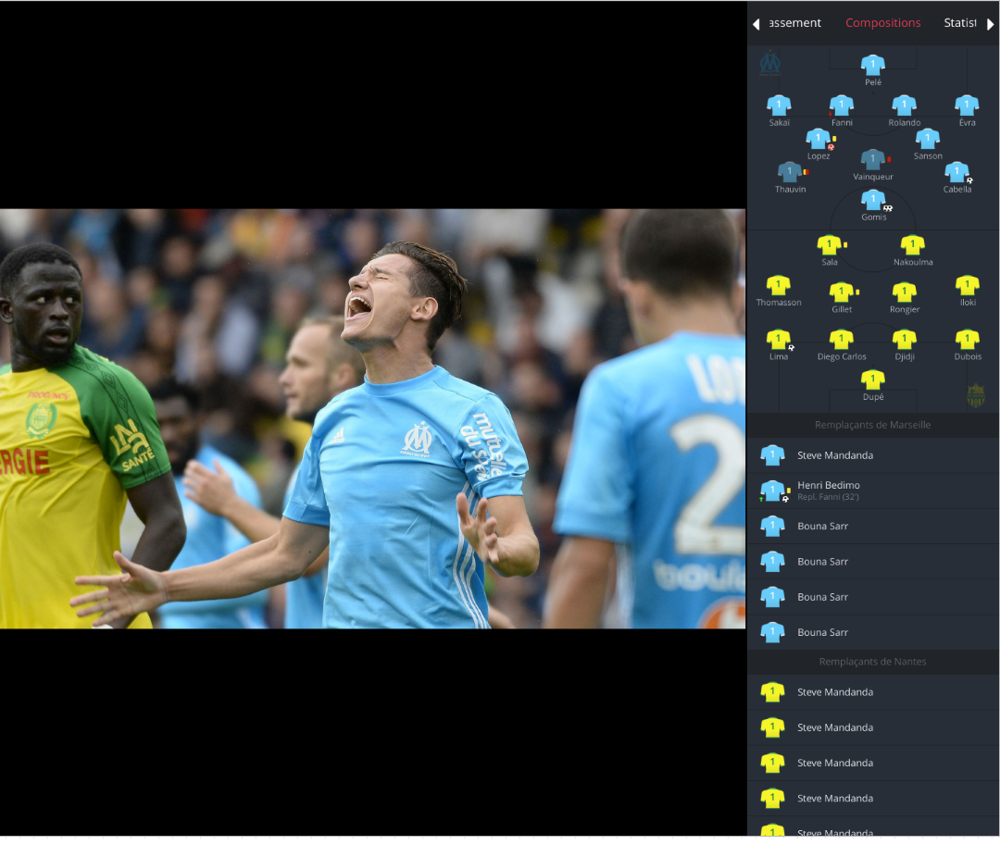
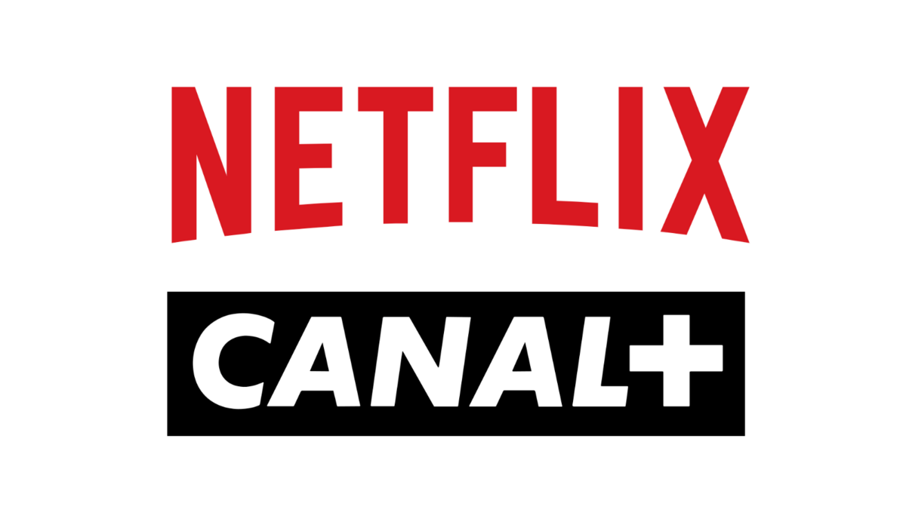
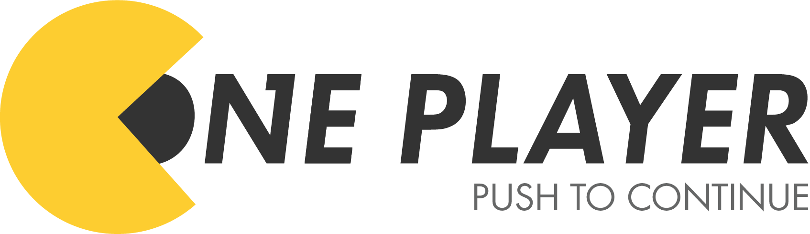

> Before going further, I would like to introduce you the company I'm working on for the current period.

CANAL+ is a french private television payable channel, focused on the cinema and sport.

It has been created in 1984, it's quite a long story now, but it also show that they successfully self reinvented and questioned what they were doing, to be able to adapt them self to the market that is continually changing.

From the beginning of its activities, the technological innovation, the excpetional freedom of expression for the era has contributed to consider Canal+ as a major actor of the television.

The sport lovers, especially the football fans, have discovered a new way of filming at the time, they were putting the viewer like he was never before.  
Canal+ possess in his DNA the creation and innovation.

Canal+ soon became iconic of the french audiovision, with over 13 millions subscriber in France.

However, they just have been catch up by netflix in France in term of number of subscribers.

## Canal+'s life

When I first applied for Canal+, I was simply a student that wanted to explore the professional world.  
I mean i was very happy to come in a company like Canal+ but I was not expecting much from them, but as I said earlier Canal+ has quite a long story now, I grew up with Canal+ at home, they were the pionneer of the entertainment and the best in France when it comes to create something new and trendy. This played a major in the idea of applying here, in addition to that, they were searching the new labors of the 21st century, **developers**!.

However, I wasn't sure about the company once inside, I thought that if Canal+ was not a match with me, I could search for another job in Paris.
But I havent thought much about it because I was going to work for a company that his main problem is to find the next entertainment for his customers.

From the first months, I was very suprised by the level of motivation we wanted to put on the product. Everyone, at least in the Tech field, was very happy to work for a product like this.

Moreover, I was also suprised by the fact that we are in close collaboration with others big-tech companies like **Google**, **Sony** or **Apple**. I mean, its always fascinating and encouraging to work with these companies, you can learn so much from them.

It's also encouraging to work for a company whereas her main range of work is the entertainment, there so few company with problems like us for video on internet. We have problems that not many people do have, but many people use video on internet.  
Building video content is expensive and tough!

Beside, the real work, there is also few extra activities related to the companies that are very cool.
Almost, at least a day in a week, there is a cool event that permit to see beyond our tech field and explore other possibilities given by the diversity of type of jobs in the company.

One of them, is the movie theater during lunch time, It's really cool to watch movie that are not out yet.

You also have the opportunity to meet many media persons but also artists, it's very rare in companies to have these kind of opportunity, I mean, I think we can count them easily.

We also have great bonus for entertaining, we got tickets for Football match, tickets for stand up show and some others with serious prices advantages.

## When tech meet media entertainment

The field is very rich in term of technologic subjects.

Canal+ is covering a large perimeter of technologic subjects because, we create and provide to the worlds our content by internet but also by satellite connection, because all our subcribers don't always have an good access to internet even in France in 2019.

To provide our content, for the subscribers's home, we also build our own set up boxes that permit to receive content through internet but also by satellite connection.

We also provide Live TV content and VOD content.

To stand out from our challenger, we try to create the entertainment of today and tomorrow.  
To achieve that, we create interactive features keep the user **active** rather than a **passive**.  
By adding features, such as the **Expert Mode**, that add extra informations for a sport live event, such as the highlights of a football game in case you missed a goal or even watch the differents angles of cameras for a formula one event, contribute to keep the user **active**.

We recently added the **multi-live** feature that allow you to watch until 4 different contents at the same time, its particularly useful to watch multiple sports event at the same time.
Up to you to configure how you want to watch your content, it gives you the possibility to focus if you want to watch a specific content or keep on the multi view to not miss a things.

However, these features added complexity for the user, he is no more passive as I said earlier, but now active, it also added complexity on how we design our code base, because we have to deal with more data that could break and so be resilient with it.

## A streaming universe

As I said earlier, Canal+ succesfully reinvented himself by putting innovation and technologies at first and it's still the case, I mean, it's really an exiciting time to work for a streaming company nowadays, everydays a new challenger come knock our door.  
These competitors are not small but huge! It's **Netflix**, **Amazon**, **Apple** and a lot of others...

Because, Canal+ is now turned on the streaming service as Netflix does, but we have more things to deal with. We are covering Live event (Sport, Ceremony...), but also VOD content (Films, Tv show, Series...).

Canal+ is also a content creator, every year around 4 to 5 tv series are created and distributed on the streaming platform (**myCanal**).  
We are also aggregator of content, this means that we are hosting other streaming platfrom services, for example in France, we have a platform owned by Orange called OCS that possess the right to broadcast HBO content in France, so we made a partnership with them to be able to broadcast their services on our platform.

More recently, we also made a parternship with Netflix and Disney+.  
Thus, Canal+ is becoming a major actor when it comes to entertaining in France, still in the logic to progress on the market by making partnership instead of be a direct challenger.

However, The big companies that are launching their platform nowadays such as Netflix, Apple, and Amazon, possess much more ressources than us, but we have to compete with them, and that is really exciting.  
You have to implement the same features than them but with less ressources, it permits to push you at your limit and gain in knowledge quicker.

Because Netflix is becoming ultra main stream and a standard in people's every day life and they ship high quality product. Thus, people are always comparing us with Netflix, because we are doing the same things than us, creating and distributing content through a subscription.

So, without directly, a certain minium quality standard hit us, because people will say _"On Netflix they are doing like this but in Canal they aren't"_. But, I see this as benefit for everyone, because a natural competition is put in place, and then always push us forward to ship quality and innovate for our user but also surpass ourself.

On the other hand, sometimes, its unfair, not technically speaking the right in very country arent the same, and in France we have much more content protection video right than in other countries, so again the others actors of the sector possess here some advantages.

I see this as a football competition, you are supposed to be less competitive team on the paper but on the field anything could happen, in most case the biggest team win but sometimes with obstinacy, humility and work, you get some rewards and this is that continue to keep waking me up every morning.

Also because, for what I think I prefer to work for something that is not the best but try to be the best, instead of directly going for something that is at the top. It's like the game is already finish.

    
    <video 
        src="https://me-blog.s3-eu-west-1.amazonaws.com/disney-plus.mp4"
        alt="disneyplus"
        controls
        style="width: 100%; margin: 15px 0;"
    >
    </video>

## Web Player Team

    
      
     

Concerning the web player, the unity where I'm working on, it's a team of around 8 peoples, including 7 developers and 1 Manager/Product owner.

We may think, that 8 peoples is a lot but this project cover a multiple complex and specific topics.

Actually, we are maintaining 2 individual projects with one with **73 000** line of codes and another one with **48 000** lines whose one rely on the other.

The one with **48 000** lines, is called the [**rx-player**](https://github.com/canalplus/rx-player), it's basically the low level abstraction of the [**HTML5 media element**](https://developer.mozilla.org/fr/docs/Web/API/HTMLMediaElement).

It uses under the hood the **MediaSource API** that permit to append video segment in the a video element, you can check out these blogs post that explain it [here](https://medium.com/canal-tech/how-video-streaming-works-on-the-web-an-introduction-7919739f7e1) and [here](https://medium.com/canal-tech/when-web-video-streaming-takes-from-finance-4fecabae1156).

It's a complex project that rely on multiple technologies as ffmpeg, DASH-MPEG, Smooth, DRM, Adaptive bitrate streaming and many others. Its also open source, feel free to check it out [here](https://github.com/canalplus/rx-player).

The second one is called the **One Player**, it's a private project, its basically the UI of the player that integrate the **rx-player** and gather all the canal's web services and where we made the interactions possible with the end user.

Since the last 2 years, both projects have grown in compexity because we are constantly adding new features to create the next entertainment.

It would be long to list all the features integrated in the player overall, but feel free to try it on [canal+](https://www.canalplus.com/)!

But with complexity, come others problems like scaling projects architecture and keep quality when doing features.

The projects are both really enjoyable and are amazing product, everydays I feel very excited to work on these projects because they are at the edge of streaming technologies nowadays and they are not restricted to the desktop devices but its also possible to port our applications to embeded devices like **Chromecast**, **Playstation** or set up **boxes**.

More and more challenges are coming, we will try to build the future of online entertaining in a streaming world.

If you liked the post and want to know more, or maybe ask me a question, feel free to write me a line on my email or Twitter :)
