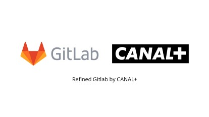

### Gitlab as Tool

At Canal+, we heavily rely on Gitlab. It provides beautiful tools for companies to organize, improve and manage large codebases with efficiency and confidence.
The Gitlab team themself define their product as a complete DevOps platform, delivered as a single application that spans the entire software development lifecycle.

They started Gitlab as an open-source project to help the team collaborate on software development, and it’s still an open-source project with over 3000 contributors.

Gitlab is shipping a new stable version every month, handle more than 50,000 CI per minute for free.

They embrace the full remote lifestyle and are pioneers of it, way before the COVID-19 pandemic and even wrote a book on how to be a successful entire remote organization. Those words make even more sense now.

### How Gitlab is used in the Player Software team

We are using Gitlab mainly for code versioning as a traditional tool in modern software development. Still, we are also using it to ship our code to production, running our test pipeline, and deploy custom branches.

Gitlab has been designed to answer some commons problems across different software engineering teams, this is highly ambitious, and they are doing it well, but they also can’t predict the need for each team in the world.

For example, our review process consists of three different team members’ validation to validate the merge requests by giving a thumbs-up once it’s looking suitable for the reviewers.

The Gitlab team can’t adapt to that specific need since it concerns only our team’s specifics, so instead, we developed a Chrome extension named Refined Gitlab.

### Introducing Refined Gitlab

[Refined Gitlab](https://chrome.google.com/webstore/detail/refined-gitlab-by-canal%20/ikaokifbikfffdgfkbhogdibaddhjfad) is a Chrome extension that aims to make the use of Gitlab easier depending on a specific need.

We can sometimes spend almost half a day on the Gitlab interface working. If the interface doesn’t match our needs, we can lose a lot of time and it makes the task painful, which impacts our direct work the wrong way.

So, it becomes quickly essential for us to explore a new path for answering that problem. The chrome extension came very fast as our leading solution to transform the UI that does not always match our need.

So, we created [Refined Gitlab](https://chrome.google.com/webstore/detail/refined-gitlab-by-canal%20/ikaokifbikfffdgfkbhogdibaddhjfad), which allows us to make our lives easier built on top of the beautiful tools that provide Gitlab.

We are using the complete Gitlab API under the hoods and the DOM to retrieve data and render them under a different shape.

[Refined Gitlab](https://chrome.google.com/webstore/detail/refined-gitlab-by-canal%20/ikaokifbikfffdgfkbhogdibaddhjfad) has been heavily inspired by [Refined Github](https://github.com/sindresorhus/refined-github) made by Sindreshorus, a famous open-source developer.

### Useful Features…

Gitlab since his start come with few useful features depending on your use cases.

#### Ordering Merge requests by WIP/Draft State

One of the first features that come up with the extension was the possibility to sort by state (Draft/WIP and classic form). Make sure that WIP/Draft state MR stays at the bottom of the list.

This feature allows us to have the same display across different Gitlab’s user interfaces and make that one single style applied across the project and users without any additional user action.

 

#### Display who approved the review

At Canal+ and at least in our teams, we need the approval of at least three developers to merge it onto the target branch.

This is different from GitLab’s official approach where only one person approves the merge request, but in our case, multiples developers have to agree.

So, we have found the solution to “thumbs-up” the Merge request when it looks good enough for the reviewer to be merged.

We can only see how many persons and who have thumbs-up only when clicking on the Merge request. We needed a way to view it quickly from the dashboard of the different merge requests.

So, thanks to the Gitlab API, we retrieved who “thumbed-up” to display it. Display who approved the review

#### Gain easy access to MR’s name branch

As GitHub is doing, having easy access to the MR name branch is critical to be productive enough and switch quickly to our local repository branch.

So, we made sure that the copying is always close enough to the user to change quickly!

 

#### Displaying changes

Another point that is important to us is to be able to quickly and easily playing our task.

Reviewing merge requests is essential and allows the project to continue growing and delivering features and bug enhancement.

So, we needed a way to quickly assert how many times a merge request must be thoroughly reviewed.

We added a label that allows us to see how many changes have been made on a merge request directly from the merge request dashboard.

 

 

Few other features are implemented inside the extension and are not mentioned here.

The full list can be found [here](https://github.com/PaulRosset/refined-gitlab-canal#features).

If a particular feature doesn’t suit your need, you can easily deactivate the feature.

### Your features…

The good news is that [Refined Gitlab](https://github.com/PaulRosset/refined-gitlab-canal) is open source, so anyone can contribute and add his feature to simplify his use, moreover, the extension is able to adapt to any Gitlab endpoint.

If you feel that the extension could help you and want to contribute, you are more than welcome to improve the extension.

Many things can still be added to improve our work environment. It’s an ongoing work continually, but it’s exciting!

Around 60+ users are already using Refined Gitlab.

Let’s join us.
